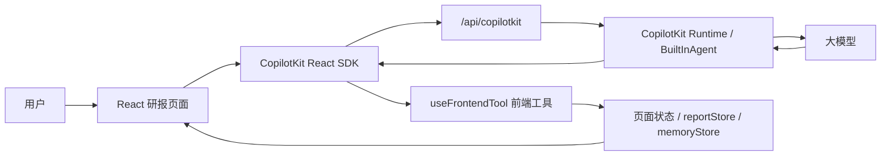

# CopilotKit 研报工作台 Demo 技术设计

## 1. 目标

这个 Demo 验证的是“AI 控制已有 React 业务页面”，不是让 AI 重新生成页面。

核心目标：

- 让 AI 读取页面状态：当前筛选、表格、选中项、操作日志、学习规则。
- 让 AI 调用前端动作：筛选、加载、排序、翻页、打开详情、导出。
- 让业务请求仍由前端业务层执行：AI 只发起工具调用，不直接改 DOM。
- 让用户可以打断 AI 后续动作，但已经发出的业务请求继续完成。
- 让系统沉淀两类经验：当前用户记忆、可审核的通用系统规则。

## 2. 总体架构



关键分工：

- `React 页面`：维护真实业务状态和 UI。
- `useAgentContext`：把必要状态暴露给 AI。
- `useFrontendTool`：注册 AI 可以调用的动作。
- `server/index.js`：承载 CopilotKit Runtime，负责连接模型。
- `reportStore.js`：模拟研报数据、筛选、排序、二级接口。
- `memoryStore.js`：保存用户记忆、系统规则候选、已批准规则。

## 3. 前端状态派控制

页面状态集中在 `src/App.jsx`：

- `filter`：当前筛选条件。
- `secondaryOptions`：当前一级分类下的二级候选项。
- `reports`：当前页表格数据。
- `pagination`：分页信息。
- `selectedIds`：当前选中研报。
- `operationLog`：用户、AI、系统的结构化操作日志。
- `knowledgeBase`：用户记忆与规则库。

AI 不直接点按钮，也不直接改 DOM。AI 调用工具后，工具函数更新这些 React state，页面自然刷新。

## 4. CopilotKit 接入点

### 4.1 `useAgentContext`

暴露给 AI 的上下文包括：

- 当前筛选和可见表格。
- 最近操作日志。
- 是否有运行中的 AI 或本地请求。
- 二级筛选的接口请求规则。
- 学习记忆和已批准规则。

注意：二级筛选候选项不直接暴露完整字典，必须通过 `loadSecondaryFilterOptions` 模拟接口请求获取。

### 4.2 `useFrontendTool`

主要工具：

- `resolveReportFilterIntent`：解析自然语言筛选意图，返回置信度和 `filterPatch`。
- `resolveSecondaryFilterIntent`：识别疑似二级词，但不直接确认二级筛选。
- `loadSecondaryFilterOptions`：按一级分类请求二级候选项，内置等待、失败重试。
- `setReportFilter`：设置筛选、排序、分页条件。
- `loadReports`：按当前条件刷新表格。
- `clearReportFilter`：清空条件并加载全部数据。
- `openReportDetail`：打开研报详情。
- `selectReports`：选中当前页研报。
- `exportVisibleReports` / `exportSelectedReports`：导出表格。

学习相关工具：

- `recordUserMemory`：记录当前用户偏好、习惯或纠错。
- `recordLearningCase`：记录一次用户纠错案例，并生成待审核规则候选。
- `proposeSystemRule`：提交一个可复用规则候选。
- `approveSystemRule`：人工批准候选规则，使其进入通用规则。
- `dismissSystemRule`：驳回候选规则。
- `forgetUserMemory`：删除某条用户记忆。

## 5. 二级筛选工作流

二级筛选不能让 AI 自己猜完整数据，因为真实系统里二级数据来自接口。

标准流程：

1. 用户说出筛选需求。
2. AI 先调用 `resolveReportFilterIntent`。
3. 如果用户已经明确一级和二级意图，调用 `loadSecondaryFilterOptions(primaryCategory)`。
4. 等接口返回。
5. 如果候选项包含目标二级值，调用 `setReportFilter({ secondaryConfirmedByUser: true })`。
6. 调用 `loadReports` 刷新列表。

失败处理：

- 第一次二级接口失败时，工具自动重试一次。
- 第二次仍失败，工具返回 `ok=false`。
- AI 必须停止后续筛选，并告知用户接口不可用。

## 6. 打断机制

打断目标不是回滚业务状态，而是停止 AI 继续规划。

当前策略：

- 用户点击打断时，调用 `agent.abortRun()`。
- AI 后续输出和后续工具调用停止。
- 已经发出的前端请求继续完成，例如正在加载表格或二级筛选。
- 请求完成后照常更新共享页面状态和 `operationLog`。

这样做的原因：

- 前端请求很多已经无法安全撤回。
- 强行回滚可能造成 UI 状态和真实接口状态不一致。
- 用户下一句问“刚才做了什么”时，AI 可以读取 `recentOperations` 和当前状态解释清楚。

## 7. 两层学习体系

### 7.1 用户记忆

用户记忆只影响当前用户。

适合保存：

- 用户偏好的交互方式，例如“少追问，能执行就先执行”。
- 用户常用筛选习惯，例如“经常看基金主题报告”。
- 用户纠正过的个人表达习惯。

不适合保存：

- 接口返回事实。
- 安全策略。
- 所有用户都应该遵守的业务规则。

### 7.2 系统规则沉淀

系统规则是可复用的抽象规则，但必须经过审核。

流程：

1. 用户纠错或反馈。
2. AI 调用 `recordLearningCase` 或 `proposeSystemRule`。
3. 系统生成 `pendingRuleCandidates`。
4. 人工在界面或通过工具批准。
5. 批准后进入 `approvedSystemRules`。
6. 后续对话中 AI 才能按该规则执行。

这样设计是为了防止“一次偶然反馈”污染全局规则。

## 8. 规则优先级

建议优先级：

1. 前端工具返回值和业务接口结果。
2. 已批准系统规则 `approvedSystemRules`。
3. 当前用户记忆。
4. 当前对话上下文。
5. 模型自己的常识。

待审核规则 `pendingRuleCandidates` 只能用于提示，不允许直接作为执行依据。

## 9. 多模块多筛选风格扩展

当前 Demo 只有一个研报筛选模块。真实中后台系统里通常会有多个筛选模块，例如：

- 模块 A：研报筛选，字段是券商、评级、行业、热度。
- 模块 B：基金筛选，字段是基金类型、规模、收益、回撤、基金经理。
- 模块 C：组合或产品筛选，字段是账户风险、持仓比例、资产类别、调仓状态。

这些模块的筛选风格、字段含义、接口链路都不一样。不能指望大模型只靠常识稳定区分，必须在架构上给它明确边界。

### 9.1 模型靠什么区分模块

大模型区分模块主要依赖四类信息：

1. 当前页面状态

```js
{
  currentModule: "fund_screener",
  visibleModule: "fund_screener",
  lastActiveModule: "report_screener"
}
```

2. 模块语义描述

```js
{
  id: "fund_screener",
  name: "基金筛选",
  description: "用于按基金类型、规模、收益、回撤、基金经理筛选基金"
}
```

3. 模块筛选 schema

```js
{
  fund_screener: {
    filter: {
      fundType: "基金类型",
      managerTenure: "基金经理任职年限",
      maxDrawdown: "最大回撤",
      annualReturn: "年化收益"
    }
  }
}
```

4. 模块独立工具

```js
setReportFilter()
loadReports()

setFundFilter()
loadFunds()

setManagerFilter()
loadManagers()
```

工具名不要做成一个过大的 `setAnyFilter`。模块工具越清晰，模型越容易选择正确动作，前端也越容易做参数校验和审计。

### 9.2 推荐的 AI Shell 架构

多模块页面建议拆成一个 AI Shell 加多个业务模块：

```text
AI Shell
  ├─ ReportModule
  ├─ FundModule
  ├─ ManagerModule
  └─ PortfolioModule
```

每个模块负责注册自己的：

- `moduleId`
- `intentHints`
- `state`
- `filterSchema`
- `actions`
- `workflowRules`
- `learningRules`

示例：

```js
const aiModules = [
  {
    id: "report",
    title: "研报筛选",
    intentHints: ["研报", "券商", "评级", "行业", "热度"],
    tools: ["setReportFilter", "loadReports", "exportVisibleReports"]
  },
  {
    id: "fund",
    title: "基金筛选",
    intentHints: ["基金", "收益", "回撤", "规模", "基金经理"],
    tools: ["setFundFilter", "loadFunds", "exportFundTable"]
  }
];
```

### 9.3 两段式上下文加载

不要一次性把所有模块的完整字段和规则都塞给模型。

推荐流程：

1. 先暴露模块目录。

```js
availableModules: [
  { id: "report", description: "研报筛选" },
  { id: "fund", description: "基金筛选" },
  { id: "manager", description: "基金经理筛选" }
]
```

2. 模型先调用 `resolveModuleIntent(userText)`。

```json
{
  "moduleId": "fund",
  "confidence": "high",
  "reason": "用户提到了基金、收益、回撤，属于基金筛选模块"
}
```

3. 前端再暴露该模块的详细 schema、状态和工具。

4. 模型调用模块内的 `resolveFilterIntent`。

5. 模型执行模块内工具。

这种方式可以减少 token、降低字段冲突，并避免模型把模块 A 的字段误用到模块 B。

### 9.4 模糊意图处理

用户可能会说：

```text
找一下高收益低风险的
```

这句话可能属于基金、组合、产品，也可能属于研报。处理策略不应该永远追问，而是按置信度分层：

- 高置信：直接进入对应模块执行。
- 中置信：优先按当前模块或最近模块执行，并说明假设。
- 低置信：才追问用户选择模块。

示例回答：

```text
我先按“基金筛选”理解，查近一年收益较高、回撤较低的基金。你也可以切到研报或组合维度。
```

这样比直接问“你是要模块 A、B 还是 C”更接近真实工作流。

### 9.5 多模块规则优先级

多模块情况下建议把规则拆成三层：

1. 全局规则
   - 打断策略。
   - 敏感动作确认。
   - 工具返回值优先于模型猜测。

2. 模块规则
   - 研报里的“买入/增持/中性”是评级。
   - 基金里的“回撤不超过 15%”是风险控制指标。
   - 基金经理里的“任职年限”是 manager tenure，不是基金成立年限。

3. 用户规则
   - 当前用户偏好的默认模块。
   - 当前用户常看的指标。
   - 当前用户对追问风格的偏好。

执行优先级：

```text
工具/接口事实 > 全局规则 > 当前模块规则 > 用户记忆 > 对话上下文 > 模型常识
```

### 9.6 旧项目落地建议

如果旧项目已经有多个页面或多个筛选区，不建议一次性做一个超大 Copilot。

推荐顺序：

1. 先选一个高频模块做试点。
2. 给该模块抽 `state adapter` 和 `action adapter`。
3. 做 `resolveModuleIntent`，哪怕暂时只有一个模块，也先把结构留出来。
4. 第二个模块接入时，不复用第一个模块的筛选字段，只复用 AI Shell。
5. 三个模块以上时，把模块目录和模块 schema 做成配置，而不是写死在 prompt。

## 10. 可迁移到旧项目的方式

旧 React 项目改造时，不一定要一次性接 CopilotKit。

可分三层迁移：

- 状态层：先把目标页面状态集中到 store 或页面 adapter。
- 动作层：把页面操作封装成稳定函数，例如 `setFilter`、`loadData`、`exportTable`。
- AI 层：用 CopilotKit 或自研 adapter 把状态和动作暴露给模型。

React 16/17 旧项目如果不能直接使用新版 CopilotKit，可以复用同样思想：

- 自己实现 `pageContext` 收集。
- 自己实现 `tool registry`。
- 后端中间层负责让模型返回 tool call。
- 前端执行 tool call 并写入操作日志。

## 11. 当前 Demo 的边界

- 数据是本地模拟，不是真实接口。
- 学习记忆保存在 `localStorage`，刷新仍在，换浏览器不存在。
- 系统规则批准是 demo 级按钮，生产环境应接权限和审计。
- 导出是 CSV，不是真正 XLSX。
- 模型仍可能误判，所以关键动作需要前端校验和人工确认。
